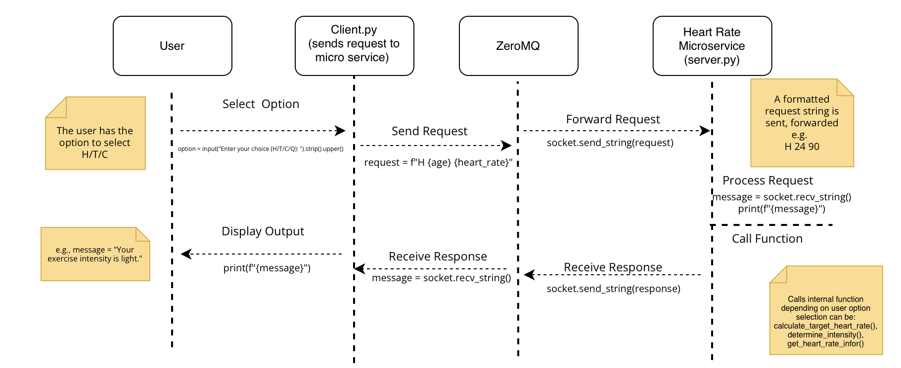

# Heart Rate Microservice  

This microservice allows users to determine heart rate intensity, calculate target heart rate zones, and receive instructions on how to check their heart rate manually. It uses **ZeroMQ** for communication between the client and the microservice.

---

## How to Programmatically Request Data  

### **1. Setup ZeroMQ Client**  
The client (`client.py`) sends requests to the microservice using a **REQ-REP** pattern. To send a request, create a ZeroMQ socket and send a properly formatted request string.

#### **Example Request for Heart Rate Intensity**  
```python
import zmq

# Setup ZeroMQ client
context = zmq.Context()
socket = context.socket(zmq.REQ)
socket.connect("tcp://localhost:5555")

# Send request
socket.send_string("H 24 60")  # Request heart rate intensity for age 24, heart rate 60 bpm
```

### **How to Programmatically Receive Data**  
Once a request is sent, the client waits for the microservice to process it and send back a response. The data is received as a string using `socket.recv_string()`.

#### **Example of Receiving Data from the server.py (Microservice)**  
```python
# Receive response from server(microservice)
response = socket.recv_string()
print(f"Response from microservice: {response}")
```

### **Expected Responses:**
| Request         | Response Example                                                    |
|------------------|--------------------------------------------------------------------|
| `"H 24 60"`      | `"Your exercise intensity is light."`                             |
| `"C 30 xxx"`     | `"Your target heart rate for moderate intensity is 95-133 bpm and for vigorous intensity is 133-162 bpm."` |
| `"T xxx xxx"`    | `"If you do not have a device that checks your heart rate for you, you can check it manually. Use two fingers on the inside of your wrist, count beats for 30 seconds, then multiply by 2."` |

### **How the Server.py (Microservice) Processes Requests**
1. Receives request via ZeroMQ REP socket
2. Parses request type, extracting age and heart rate if applicable
3. Processes the request to determine intensity, target heart rate, or instructions
4. Sends a response back to the client

## UML Diagram
